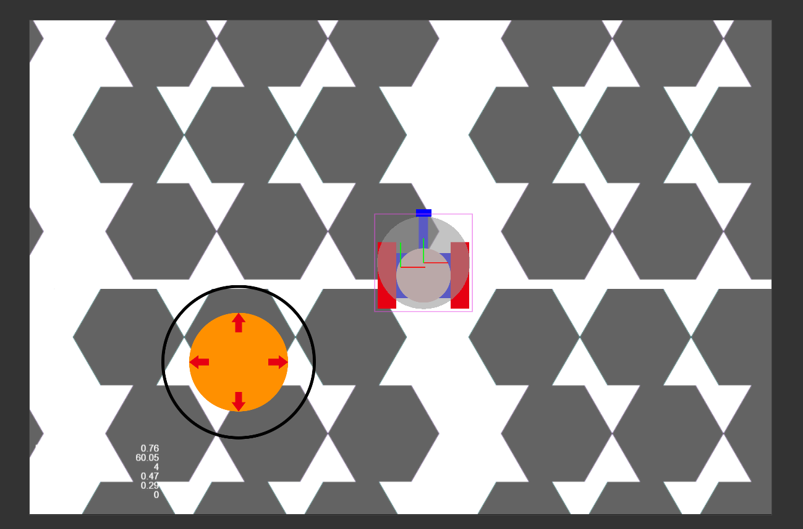
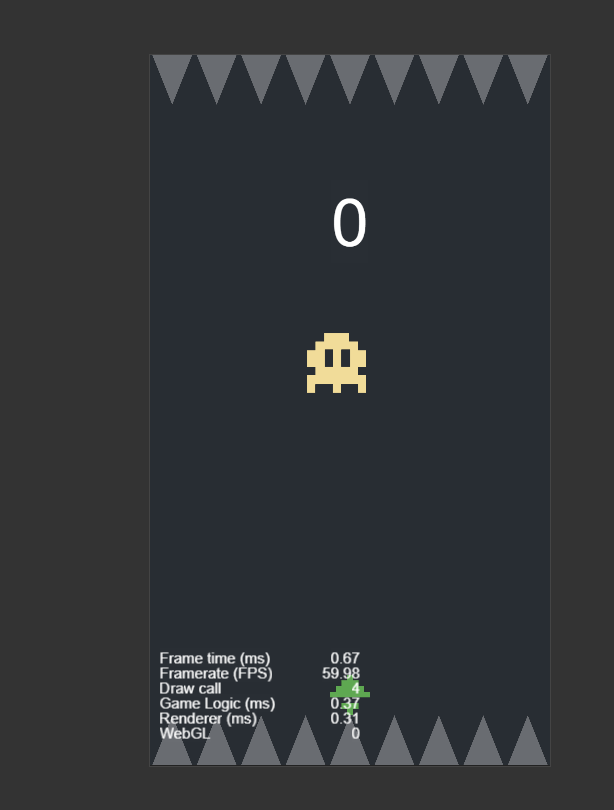

# cocos_Exercise

## cocos 學習

### 坦克大戰(TS_tank)

就是做個搖桿來移動坦克

[教學網址](https://www.bilibili.com/video/BV1JE411D7C5?p=7)

### 爆破點點(BlastBit)

做一個小遊戲來檢視Cocos 的製作方式

[教學網址](https://www.bilibili.com/video/BV1CE411k78J?p=2)

# 使用工具

Cocos Creator 2.4.0 + TypeScript

Vs Code

# 小節

Cocos Creator 是一個基於 Cocos 引擎的開發套件

在應用上比單純對Cocos 引擎敲代碼方便

佈局含邏輯上很像Unity引擎，所以由 Unity 跨到 Cocos Creator 是很方便

加上Cocos Creator使用的是 JavaScript 或是 TypeScript

在撰寫上比C++ C#方便一些，

但Cocos Creator還是難以跟Unity相比

但在開發純2D上Cocos Creator不失為一選擇

# 責任聲明：

[Blog位置](https://www.notion.so/Blog-f5fca1cafe1f4379aebeeb6260dd3dc6)

本Blog裡部分資料如為外部引用，版權為原著作者所有

若非，版權歸本Blog所有，

若是有侵權之於，請聯繫Emall:peterlukgit@gmail.com

若是並未第一時間回復，請稍等數日，或是再寄一封確認

本Blog意在製作遊戲教學，

若轉載請保留標示姓名，原出處，禁止商用
